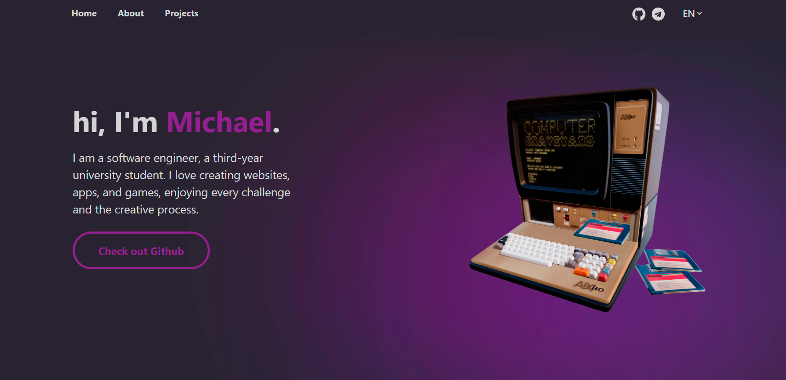

# Michael 

📌 Мой сайт портфолио создан для демонстрации моих навыков веб-разработки и проектов, над которыми я работал. 

 

## 💻 Запуск проекта
```
git clone https://github.com/mykhailoko/Michael.git
cd Michael
npm install
npm run dev
```
## 🛠 Технологии
- **React + JavaScript:** динамичный интерфейс
- **SCSS:** удобная и структурированная стилизация
- **Three.js:** 3D-объект для интерактивного эффекта
- **Bootstrap:** слайдер проектов
- **i18next:** английский и русский языки
